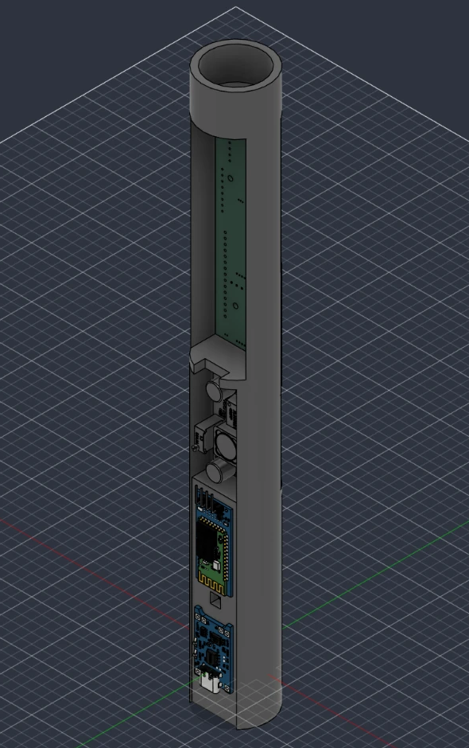

# Arduino Lightsaber ⚔️

A motion-reactive lightsaber built around an Arduino Nano on a custom PCB. It has a
144-LED WS2812B blade, sound from a DFPlayer Mini, swing detection with an MPU-6050,
and one-button control.

<!-- Demo video goes here: drag an .mp4 into a GitHub issue to get a user-attachments link, or embed YouTube -->

## Features

Firmware **KYBER OS 2**: a small feature set, done properly.

- **Blade:** 144 LEDs, 6 colours (azure, jade, ruby, amber, iris, ice) in one carefully tuned
  look (hot core, slow shimmer, gentle breathing), with a sweep ignite/retract and tip flare. Swinging heats the blade toward
  white, and blaster blocks flash where they land.
- **Motion:** swing detection on the MPU-6050 (total rotation speed, so no axis setup), one sensitivity
  setting, one-press gyro calibration (lay it still, menu > CALIBRATE).
- **Sound:** a seamless hum loop on a single DFPlayer, with swing and blaster sounds
  layered on top, and a lockup loop. The blade sounds are a real saber sound font (TeensySF, CC BY-SA 4.0; see
  [firmware/sd-card/README.md](firmware/sd-card/README.md)).
- **Battery:** the cell feeds the 5V pin directly and is read as Vcc. Percentage and warnings
  use the resting voltage, so the sag from a lit blade doesn't trigger them. One low-battery
  warning per low spell, and the blade is locked out only when the cell is really empty.
- **Portrait OLED:** a live mini-saber, the battery, and an 8-page menu. Rendered as scanlines
  with no framebuffer.
- Auto-retract after 5 minutes idle. Settings live in EEPROM.

*Run `python firmware/tools/sim/run_sim.py` to render the current OLED screens and blade
effects into `firmware/tools/out/`.*

## Controls

Two buttons: **MAIN** (D2) and **AUX** (D3).

| Blade off | |
|---|---|
| MAIN click | Ignite |
| AUX click / double-click | Next / previous colour |
| AUX hold | Menu |

| Blade on | |
|---|---|
| MAIN click | Retract |
| AUX click | Blaster block |
| AUX hold | Lockup while held |
| Swing | Detected automatically |

| Menu | |
|---|---|
| AUX click / double-click | Next / previous page |
| MAIN click | Change value / run action |
| AUX hold | Save and exit |

Menu pages: sound, light, colour, sensitivity, flip, calibrate, battery (millivolts), exit.
Light and colour preview on the blade.

## Repository layout

```
firmware/
  lightsaber/                 Arduino sketch (Nano, ATmega328P), one module per subsystem
  sd-card/                    Sound font for the DFPlayer (MP3/ + ADVERT/ folders)
  tools/                      Asset and sound generators, PC simulator
hardware/
  kicad/                      KiCad 8 project (schematic + PCB)
  fabrication/                Gerber zip exactly as ordered (V3)
  exports/                    Schematic PDF/SVG, PCB front/back SVG
  3d/                         Fusion 360 hilt assembly (.f3z), printable tube (.stl), PCB STEP
docs/
  hardware.md                 BOM, as-built pin map, known board issues
  images/                     Diagrams and README images
media/
  videos/  photos/            Build and demo media (videos via Git LFS)
```

## Hardware

| | |
|---|---|
| MCU | Arduino Nano v3 |
| Motion | GY-521 / MPU-6050 (I²C) |
| Sound | DFPlayer Mini → external amp + speaker |
| Blade | WS2812B, 144 LEDs, data on D6 |
| Input | Main button D2, aux button D3 |
| Battery | 18650 straight to the 5V pin, read as Vcc |
| Display | 0.91" SSD1306 128×32 OLED (mounted along the hilt), software I²C on D8 (SDA) / D9 (SCL) |

The full BOM, pin map and known PCB issues are in **[docs/hardware.md](docs/hardware.md)**.
The schematic is in [hardware/exports/lightsaber-schematic.pdf](hardware/exports/lightsaber-schematic.pdf).

| PCB front | PCB back |
|---|---|
|  |  |

### Hilt

The hilt is modelled in Fusion 360 as a full assembly with the PCB and every module in place:
[hardware/3d/lightsaber-hilt.f3z](hardware/3d/lightsaber-hilt.f3z). Open it in Fusion with
**File → Open → Open from my computer**. The linked component models are bundled in the archive.



**[View the hilt tube in 3D](hardware/3d/hilt-tube.stl)** (GitHub shows STL files in an interactive viewer).
The same file is ready to slice for printing.

Besides the PCB, the model holds the 18650 battery holder, TP4056 USB-C charger, XL6009 boost
converter, PAM8403 amp, flat speaker, two tactile buttons and the OLED. See
[docs/hardware.md](docs/hardware.md#hilt--3d-model) for details.

> The schematic has known mistakes. The V3 board was built from it and the firmware works
> around them, so treat the board and firmware as the real reference.

## Firmware

### Build & flash

No third-party libraries needed: the drivers for the LEDs, OLED, DFPlayer, I2C and
buttons are all built in.

```bash
arduino-cli compile -b arduino:avr:nano firmware/lightsaber
arduino-cli upload -b arduino:avr:nano -p COM3 firmware/lightsaber
```

Clone Nanos may need `arduino:avr:nano:cpu=atmega328old`. It builds to ~19.5 KB of the
30 KB flash and uses 42% of RAM. Build-time options (pins, LED count, current budget,
battery thresholds, motion thresholds) are in
[`firmware/lightsaber/config.h`](firmware/lightsaber/config.h).

For serial telemetry (swing, roll, pitch, shock, battery at 115200 baud on the USB port), build with:

```bash
arduino-cli compile -b arduino:avr:nano --build-property "compiler.cpp.extra_flags=-DDEBUG_SERIAL=1" firmware/lightsaber
```

**First run:**
1. If the screen is upside down, set it with menu > FLIP.
2. Lay the saber still and run menu > CALIBRATE to zero the gyro (it also does this
   by itself at power-up if the saber is still).
3. Check menu > BATTERY against a multimeter; adjust `BANDGAP_MV` if it is off.

### Architecture

| Module | Job |
|--------|-----|
| `saber.cpp` | Modes and controls -> effects and sounds |
| `imu.cpp` | MPU-6050 at 1 kHz, +-2000 deg/s, +-16 g. Swing peak detection from total rotation speed, gyro drift tracking |
| `blade.cpp` | Per-pixel blade look + ignition + effect overlay compositor. The only buffer is the LED array |
| `color.cpp` | WS2812B driver (cycle-exact 16 MHz loop), current limiting, HSV |
| `ui.cpp`, `gfx.h`, `oled.cpp` | Portrait OLED UI, streamed as scanlines |
| `audio.cpp` | DFPlayer protocol, TX-only bit-banged serial, command queue, hum loop + adverts |
| `buttons.cpp` | Debounce, multi-click, hold, chords |
| `power.cpp` | Cell voltage (Vcc against the 1.1 V bandgap), resting vs loaded |
| `settings.cpp` | EEPROM settings and the colour table |

How it fits in 2 KB of RAM and a 16 MHz CPU:

- **No OLED framebuffer.** The SSD1306 runs in vertical addressing mode, so with the
  panel stood on end, each physical column is exactly one 32-pixel row of the portrait
  screen. Every screen is a function that returns one row as a `uint32_t`. The UI
  streams 16 rows per `loop()` pass, a full frame about every 8 passes, and the rows
  never exist in RAM together.
- **Nothing blocks.** The longest stall is one LED frame (4.3 ms) or one DFPlayer
  command (10 ms). The main loop runs at ~110 Hz, sampling motion, rendering the blade
  and streaming the display in turn.
- **Sound without BUSY.** Serial RX can't survive the LED strip's interrupt-free frames,
  so the player is driven blind. The hum is looped on the main channel, effects are
  adverts that resume it, and one-shot lengths come from `sound_lengths.h`. At boot,
  before the LEDs run, RX is polled once to detect the module and SD card.

### Tools

```bash
python firmware/tools/gen_assets.py     # font + pixel-art icons -> assets.h (edit the art in the script)
python firmware/tools/make_sounds.py    # synthesize the sound font -> sd-card/, sound_lengths.h
python firmware/tools/sim/run_sim.py    # compile ui/blade on the PC, render screens + blade timelines
```

The simulator (MSYS2 g++ or MSVC) runs the real `ui.cpp` and `blade.cpp` and writes
PNGs to `firmware/tools/out/`. Use it to design screens and effects without flashing.

### SD card

Copy `firmware/sd-card/MP3` and `firmware/sd-card/ADVERT` to a FAT32 micro-SD. See
[firmware/sd-card/README.md](firmware/sd-card/README.md) for the track map and how to
use your own font.

## Status

The V3 PCB has been fabricated. KYBER OS 2 builds and has been checked in the PC simulator,
but hasn't been flashed to the board yet. See the
[known issues](docs/hardware.md#known-issues) for hardware bugs.

### TODO

- [ ] Tune the swing thresholds in `config.h` once it has been swung around.

## License

[MIT](LICENSE)
