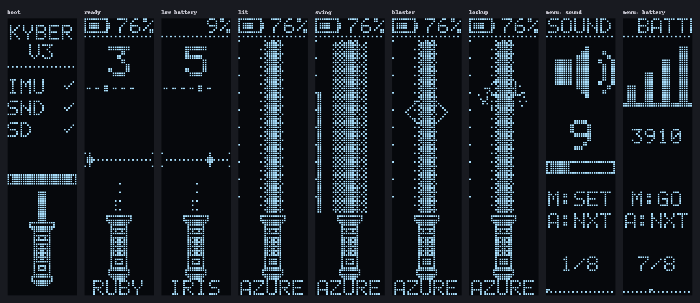
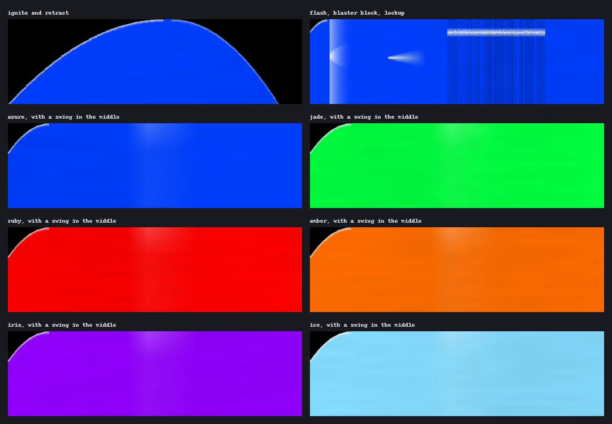

# Arduino Lightsaber

A lightsaber prop built around an Arduino Nano on a custom PCB. It has a 144-LED blade,
sound from a DFPlayer Mini, swing detection with an MPU-6050, a small OLED and two buttons.
I built it for a Halloween costume.



*The OLED screens, rendered by the firmware's own UI code in a PC simulator.*

## Hardware

| | |
|---|---|
| Microcontroller | Arduino Nano (ATmega328P) |
| Motion | GY-521 (MPU-6050) on I²C |
| Sound | DFPlayer Mini, external amplifier and speaker |
| Blade | WS2812B strip, 144 LEDs, data on D6 |
| Buttons | main on D2, aux on D3 |
| Display | 0.91" SSD1306 128×32 OLED, software I²C on D8 (SDA) and D9 (SCL) |
| Power | one 18650 cell wired to the Nano's 5V pin, no boost converter |

The pin map, bill of materials and the known problems with the V3 board are in
[docs/hardware.md](docs/hardware.md). The schematic is in
[hardware/exports](hardware/exports/lightsaber-schematic.pdf). The schematic has mistakes the
board inherited; the firmware works around them, so trust the board and `docs/hardware.md`
over the schematic.

The hilt is modelled in Fusion 360 ([lightsaber-hilt.f3z](hardware/3d/lightsaber-hilt.f3z)),
and the printable tube is [hilt-tube.stl](hardware/3d/hilt-tube.stl), which GitHub shows in a
3D viewer.


## Building

You need [arduino-cli](https://arduino.github.io/arduino-cli/) with the `arduino:avr` core.
The sketch has no third-party libraries.

```bash
arduino-cli compile -b arduino:avr:nano firmware/lightsaber
arduino-cli upload -b arduino:avr:nano -p COM3 firmware/lightsaber
```

Nano clones with the old bootloader need `arduino:avr:nano:cpu=atmega328old`. The build uses
about 18 KB of the 30 KB of flash and 42% of RAM. Pins, LED count, current limit and the
battery and motion thresholds are in [config.h](firmware/lightsaber/config.h).

Building with `-DDEBUG_SERIAL=1` prints swing speed and battery voltage over USB at 115200 baud:

```bash
arduino-cli compile -b arduino:avr:nano --build-property "compiler.cpp.extra_flags=-DDEBUG_SERIAL=1" firmware/lightsaber
```

### SD card

```bash
pip install numpy
python firmware/tools/build_sd_card.py
```

This fills `firmware/sd-card/` and writes `sound_lengths.h`. Copy the `MP3` and `ADVERT`
folders to the root of a FAT32 micro-SD card. Details and the track list are in
[firmware/sd-card/README.md](firmware/sd-card/README.md).

### First run

1. If the screen is upside down, flip it in the menu.
2. Lay the saber still and run CALIBRATE in the menu. This zeroes the gyro. It also happens
   at power-up if the saber is lying still.
3. Compare the BATTERY page with a multimeter on the cell. If it's off, scale `BANDGAP_MV`
   in `config.h`; the Nano's voltage reference is only accurate to about 10%.

## Controls

| Blade off | |
|---|---|
| MAIN click | Ignite |
| AUX click, double click | Next colour, previous colour |
| AUX hold | Open the menu |

| Blade on | |
|---|---|
| MAIN click | Retract |
| AUX click | Blaster block |
| AUX hold | Lockup, until released |
| Swing | Swing sound (automatic) |

| Menu | |
|---|---|
| AUX click, double click | Next page, previous page |
| MAIN click | Change the value or run the action |
| AUX hold | Save and exit |

The menu pages are sound, light, colour, sensitivity, flip, calibrate, battery and exit.
Light and colour preview on the blade. The saber retracts by itself after five minutes
without movement.

## How it works

The blade is rendered per pixel into the LED array, which is the only frame buffer in the
sketch. The OLED has none either. The panel is mounted on its side and driven in vertical
addressing mode, so one physical column is one 32-pixel row of the portrait screen. Each
screen is a function that returns a row as a `uint32_t`, and the UI streams a few rows per
`loop()` pass.

The LED strip needs interrupts off for about 4 ms per frame, which rules out serial
receive. The DFPlayer is therefore driven blind. The hum loops on the main channel,
effects play as DFPlayer adverts that pause and then resume it, and the one-shot lengths are
compiled in so the firmware can stop them when they end.

The cell feeds the Nano's supply directly, so the supply voltage is the cell voltage. The
firmware measures it against the internal 1.1 V reference. Charge level and warnings use the
voltage with the blade off, because the strip pulls it down by several tenths of a volt when lit.

| Module | Job |
|---|---|
| `saber.cpp` | modes and controls |
| `imu.cpp` | MPU-6050 reading and swing detection |
| `blade.cpp` | blade colours, ignition and effects |
| `color.cpp` | WS2812B driver, current limit |
| `ui.cpp`, `gfx.h`, `oled.cpp` | OLED screens and display driver |
| `audio.cpp` | DFPlayer protocol and sound playback |
| `buttons.cpp` | debouncing, clicks, holds |
| `power.cpp` | battery voltage |
| `settings.cpp` | EEPROM settings, colour table |

## Repository

```
firmware/lightsaber/   the sketch
firmware/sd-card/      sounds for the DFPlayer
firmware/tools/        asset and SD card builders, PC simulator
hardware/kicad/        KiCad 8 project
hardware/fabrication/  gerbers exactly as ordered (V3)
hardware/exports/      schematic PDF, PCB renders
hardware/3d/           hilt model, tube STL, PCB STEP
docs/                  hardware notes, images
```

The simulator runs the real `ui.cpp` and `blade.cpp` on a PC (it needs MSYS2 g++ or MSVC):

```bash
python firmware/tools/sim/run_sim.py
python firmware/tools/make_readme_images.py
```



*Blade timelines from the simulator. Time runs left to right and the hilt is at the bottom.*

## Credits

The blade sounds come from the TeensySF font in the
[ProffieOS](https://fredrik.hubbe.net/lightsaber/) default SD card, by Fredrik Hubinette
([CC BY-SA 4.0](https://creativecommons.org/licenses/by-sa/4.0/)). The menu and boot sounds
are synthesized by the repository's tools.

## License

[MIT](LICENSE). The sound files are under their own licence, see above.
