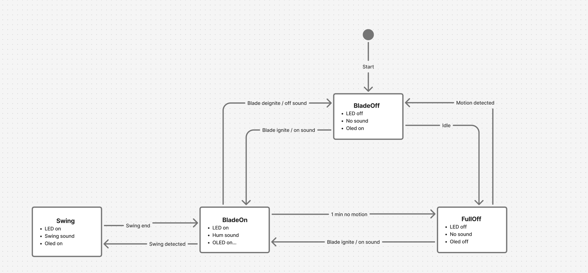

# Arduino Lightsaber ⚔️

A motion-reactive lightsaber built around an Arduino Nano on a custom PCB. It has a
144-LED WS2812B blade, sound from a DFPlayer Mini, swing detection with an MPU-6050,
and one-button control.

<!-- Demo video goes here: drag an .mp4 into a GitHub issue to get a user-attachments link, or embed YouTube -->

## Features

- Ignite and retract animations, with matching sounds
- Hum while the blade is lit
- Swing detection that plays a swing sound
- 7 blade colours (blue, green, red, purple, cyan, orange, white)
- Auto power-down after 1 minute without motion. Moving the hilt wakes it again.

## Controls

| Action | Result |
|--------|--------|
| Single click | Ignite / retract blade |
| Double click | Cycle blade colour |
| Long press | Full off (blade + sound off, low-power idle) |

## Repository layout

```
firmware/
  lightsaber/lightsaber.ino   Arduino sketch (Nano, ATmega328P)
  sd-card/                    DFPlayer SD card layout + sound files
hardware/
  kicad/                      KiCad 8 project (schematic + PCB)
  fabrication/                Gerber zip exactly as ordered (V3)
  exports/                    Schematic PDF/SVG, PCB front/back SVG
  3d/                         STEP model of the assembled PCB
docs/
  hardware.md                 BOM, as-built pin map, known board issues
  images/                     Diagrams and README images
media/
  videos/  photos/            Build and demo media (videos via Git LFS)
```

## Hardware

| | |
|---|---|
| MCU | Arduino Nano v3 |
| Motion | GY-521 / MPU-6050 (I²C) |
| Sound | DFPlayer Mini → external amp + speaker |
| Blade | WS2812B, 144 LEDs, data on D6 |
| Input | Momentary button on D2 |

The full BOM, pin map and known PCB issues are in **[docs/hardware.md](docs/hardware.md)**.
The schematic is in [hardware/exports/lightsaber-schematic.pdf](hardware/exports/lightsaber-schematic.pdf).

| PCB front | PCB back |
|---|---|
|  |  |

> The schematic has known mistakes. The V3 board was built from it and the firmware works
> around them, so treat the board and firmware as the real reference.

## Firmware

### Build & flash

Libraries: **FastLED** (3.10.x), **OneButton** (2.6.x), **DFRobotDFPlayerMini** (1.0.6).

```bash
arduino-cli lib install FastLED OneButton DFRobotDFPlayerMini
arduino-cli compile -b arduino:avr:nano firmware/lightsaber
arduino-cli upload -b arduino:avr:nano -p COM3 firmware/lightsaber
```

Clone Nanos may need `arduino:avr:nano:cpu=atmega328old`. Serial monitor runs at 115200 baud.

### SD card

Copy the four sound files to a FAT32 micro-SD as described in
[firmware/sd-card/README.md](firmware/sd-card/README.md).

### State machine

[](https://www.figma.com/board/5enRDFjjQfPsD2e3D49wmu/Lightsaber-State-Machine--Styled-States-?node-id=0-1&t=7872wVc0ggQ7v5lB-1)

| State | Blade | Sound | Exits |
|-------|-------|-------|-------|
| `BLADE_OFF` (start) | off | none | click → `BLADE_ON`; 1 min idle → `FULL_OFF` |
| `BLADE_ON` | lit | hum | swing → `SWING`; click → `BLADE_OFF`; 1 min idle → `FULL_OFF` |
| `SWING` | lit | swing | motion settles → `BLADE_ON`; click → `BLADE_OFF` |
| `FULL_OFF` | off | none | motion → `BLADE_OFF`; click → `BLADE_ON` |

Long press goes to `FULL_OFF` from any state. The diagram shows an OLED, which isn't
implemented in the firmware yet.

## Status

The V3 PCB has been fabricated and the firmware runs on it. See the
[known issues](docs/hardware.md#known-issues) for hardware bugs.

## License

[MIT](LICENSE)
